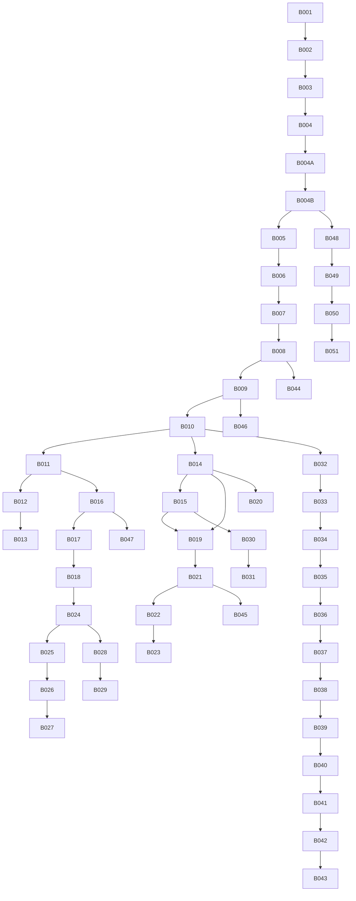

# 后端实现任务清单

**Branch**: `001-bilibili-monitor` | **Generated**: 2025-12-20  
**Reference**: [backend-plan.md](./backend-plan.md) | [backend-architecture.md](./backend-architecture.md)

---

## Phase 1: 基础框架搭建

### B001 - 初始化 Bun + Hono 项目
- [X] 创建 `backend/package.json`
- [X] 配置 `backend/tsconfig.json`
- [X] 安装核心依赖：`hono`, `drizzle-orm`, `zod`, `jose`
- [X] 创建 `src/index.ts` 入口文件
- [X] 验证 `bun run dev` 能启动 HTTP 服务

**文件**:
```
backend/
├── package.json
├── tsconfig.json
├── src/
│   └── index.ts
```

**验收**: `curl http://localhost:8080/health` 返回 200

---

### B002 - 配置环境变量加载
- [X] 创建 `src/config/env.ts` 定义环境变量类型
- [X] 使用 Bun 内置 `process.env` 读取
- [X] 创建 `.env.example` 模板文件
- [X] 实现配置验证（Zod schema）

**环境变量**:
```env
PORT=8080
NODE_ENV=development

# Database
DB_TYPE=sqlite
SQLITE_PATH=./data/app.db
DATABASE_URL=

# Auth
JWT_SECRET=
JWT_EXPIRES_IN=7d

# Encryption
ENCRYPT_KEY=

# Bili
BILI_USER_AGENT=
```

---

### B003 - 配置 Drizzle ORM（双数据库）
- [X] 安装 `drizzle-orm`, `drizzle-kit`, `better-sqlite3`, `postgres`
- [X] 创建 `drizzle.config.ts`
- [X] 创建 `src/db/index.ts` 数据库工厂函数
- [X] 实现 SQLite 连接
- [X] 实现 PostgreSQL 连接
- [X] 根据 `DB_TYPE` 环境变量自动选择

**代码示例**:
```typescript
// src/db/index.ts
export function createDb(config: DbConfig) {
  if (config.type === 'sqlite') {
    const sqlite = new Database(config.sqlitePath)
    return drizzle(sqlite, { schema })
  } else {
    const client = postgres(config.postgresUrl)
    return drizzle(client, { schema })
  }
}
```

---

### B004 - 定义 Drizzle Schema
- [X] 创建 `src/db/schema.ts`
- [X] 定义 `users` 表
- [X] 定义 `accounts` 表
- [X] 定义 `tasks` 表（包含 `cidRetries` 字段）
- [X] 定义 `video_metrics` 表
- [X] 定义 `author_metrics` 表
- [X] 定义 `notify_channels` 表
- [X] 定义 `notify_rules` 表
- [X] 定义 `system_logs` 表
- [X] 定义 `settings` 表
- [X] 定义 `media_assets` 表

**参考**: [data-model.md](./data-model.md)

---

### B004A - 生成数据库迁移文件
- [x] 运行 `bun run db:push` 直接应用 schema 到数据库
- [x] 验证所有表已创建（10 个表：users, accounts, tasks, video_metrics, author_metrics, notify_channels, notify_rules, system_logs, settings, media_assets）
- [x] 检查表结构是否正确（字段、索引、外键）
- [ ] 生成迁移文件（可选，drizzle-kit 0.20.0 使用 push 模式）

**命令**:
```bash
cd backend
bun run db:generate
```

**验收**: `src/db/migrations/` 目录存在且包含迁移文件

---

### B004B - 运行数据库迁移
- [x] 使用 `bun run db:push` 直接应用 schema（drizzle-kit 0.20.0 推荐方式）
- [x] 验证所有表已创建（10 个表全部创建成功）
- [x] 检查表结构是否正确（所有字段、索引、外键已正确创建）
- [x] 验证可以重复运行（push 命令是幂等的）

**命令**:
```bash
cd backend
bun run db:migrate
```

**验收**: 
- SQLite: `sqlite3 data/app.db ".tables"` 显示所有表
- PostgreSQL: `psql $DATABASE_URL -c "\dt"` 显示所有表

---

### B005 - 实现统一响应格式
- [X] 创建 `src/utils/response.ts`
- [X] 实现 `success<T>(data: T, message?: string)` 函数
- [X] 实现 `error(code: number, message: string, detail?: any)` 函数
- [X] 定义标准错误码

**响应格式**:
```typescript
interface ApiResponse<T> {
  code: number      // 0 = success
  message: string
  data?: T
}
```

---

### B006 - 实现错误处理中间件
- [X] 创建 `src/middlewares/error.ts`
- [X] 捕获所有未处理异常
- [X] 区分 Zod 验证错误
- [X] 区分业务错误 vs 系统错误
- [X] 返回标准错误响应
- [X] 记录错误日志

---

### B007 - 实现请求日志中间件
- [X] 创建 `src/middlewares/logger.ts`
- [X] 记录请求方法、路径、耗时
- [X] 记录响应状态码
- [X] 可选：记录到 system_logs 表

---

### B008 - 实现 JWT 认证中间件
- [X] 创建 `src/middlewares/auth.ts`
- [X] 使用 `jose` 库验证 JWT
- [X] 从 Authorization header 提取 token
- [X] 验证失败返回 401
- [X] 验证成功注入 `c.set('user', payload)`
- [X] 支持跳过特定路由（如 /health, /auth/login）

---

### B009 - 实现日志服务
- [X] 创建 `src/services/log.ts`
- [X] 实现 `log(level, source, message)` 方法
- [X] 实现 `query(filters)` 方法
- [X] 实现 `download(filters)` 方法
- [X] 支持日志级别：DEBUG, INFO, WARNING, ERROR

---

### B010 - 创建轻量 DI 容器
- [X] 创建 `src/services/container.ts`
- [X] 定义 `ServiceContainer` 接口
- [X] 实现 `createContainer(config)` 工厂函数
- [X] 初始化所有服务单例
- [X] 在 Hono 中间件中注入

**代码示例**:
```typescript
export interface ServiceContainer {
  config: AppConfig
  db: DrizzleInstance
  biliApi: BiliApiClient
  scheduler: SchedulerService
  notifier: NotificationService
  logger: LogService
}

export function createContainer(config: AppConfig): ServiceContainer {
  const db = createDb(config.database)
  const logger = new LogService(db)
  const biliApi = new BiliApiClient(config.bili)
  const notifier = new NotificationService(config.notify)
  const scheduler = new SchedulerService(db, biliApi, notifier, logger)
  
  return { config, db, biliApi, scheduler, notifier, logger }
}
```

---

## Phase 2: B站 API 集成

### B011 - 实现 WBI 签名服务
- [x] 创建 `src/services/bili/wbi.ts`
- [x] 实现 MIXIN_KEY_ENC_TAB 常量
- [x] 实现 `getMixinKey(orig: string)` 方法
- [x] 实现 `refreshKeys()` 从 nav 接口获取 img_key/sub_key
- [x] 实现 `signParams(params)` 添加 w_rid + wts
- [x] 添加 key 缓存（12小时有效期）

**算法参考**: [wbi.md](../../docs/bili-api/wbi.md)

**测试用例**:
```typescript
// 输入参数
const params = { foo: '114', bar: '514', baz: '1919810' }
// 预期输出包含
expect(result.wts).toBeDefined()
expect(result.w_rid).toMatch(/^[a-f0-9]{32}$/)
```

---

### B012 - 实现二维码登录（生成）
- [x] 在 `src/services/bili/client.ts` 添加 `generateQrCode()` 方法
- [x] 调用 `/x/passport-login/web/qrcode/generate`
- [x] 返回 `{ qrcodeKey, qrUrl, expireAt }`
- [x] 在 `src/services/account.ts` 创建 QR 会话记录（TODO: 持久化）

**B站 API**:
```
GET https://passport.bilibili.com/x/passport-login/web/qrcode/generate
Response: { code, data: { url, qrcode_key } }
```

---

### B013 - 实现二维码登录（轮询）
- [x] 在 `src/services/bili/client.ts` 添加 `pollQrCodeStatus(qrcodeKey)` 方法
- [x] 调用 `/x/passport-login/web/qrcode/poll`
- [x] 返回状态码：0=成功, 86101=未扫码, 86090=已扫待确认, 86038=过期
- [x] 成功时从 URL 提取 Cookie

**B站 API**:
```
GET https://passport.bilibili.com/x/passport-login/web/qrcode/poll?qrcode_key=xxx
Response: { code, data: { code, message, url } }
```

---

### B014 - 实现 Cookie 绑定
- [x] 在 `src/services/account.ts` 添加 `bindByCookie(cookie)` 方法
- [x] 从 Cookie 字符串提取 SESSDATA, bili_jct
- [x] 验证凭据有效性
- [x] 加密存储到数据库

**Cookie 解析**:
```typescript
function extractFromCookie(cookie: string): { sessdata?: string; biliJct?: string } {
  const sessdataMatch = cookie.match(/SESSDATA=([^;]+)/)
  const biliJctMatch = cookie.match(/bili_jct=([^;]+)/)
  return {
    sessdata: sessdataMatch?.[1],
    biliJct: biliJctMatch?.[1]
  }
}
```

---

### B015 - 实现账号验证
- [x] 在 `src/services/account.ts` 添加 `validateAccount(accountId)` 方法
- [x] 调用 B站 nav 接口验证登录状态
- [x] 成功时刷新 img_key/sub_key
- [x] 失败时增加 `lastFailures` 计数
- [x] 连续失败 > 5 次时触发账号过期处理

---

### B016 - 实现视频信息获取
- [x] 在 `src/services/bili/client.ts` 添加 `getVideoView(bvid)` 方法
- [x] 调用 `/x/web-interface/view`
- [x] 返回 `{ bvid, title, cid, pubdate, owner: { mid, name } }`

**B站 API**:
```
GET https://api.bilibili.com/x/web-interface/view?bvid=BVxxx
Response: { code, data: { bvid, title, cid, pubdate, owner: { mid, name }, stat: {...} } }
```

---

### B017 - 实现在线人数获取
- [x] 在 `src/services/bili/client.ts` 添加 `getOnlineTotal(bvid, cid)` 方法
- [x] 调用 `/x/player/online/total`
- [x] 返回 `{ total }`

---

### B018 - 实现粉丝数获取
- [x] 在 `src/services/bili/client.ts` 添加 `getUserStat(mid)` 方法
- [x] 调用 `/x/relation/stat`（需要 WBI 签名）
- [x] 返回 `{ follower }`

---

### B019 - 实现账号管理路由
- [x] 创建 `src/routes/accounts.ts`
- [x] `GET /api/v1/accounts` - 列表
- [x] `POST /api/v1/accounts/cookie` - Cookie 绑定
- [x] `POST /api/v1/accounts/qrcode` - 生成二维码
- [x] `GET /api/v1/accounts/qrcode/status` - 轮询状态
- [x] `DELETE /api/v1/accounts/:id` - 删除账号
- [x] `GET /api/v1/accounts/default` - 获取默认账号
- [x] `POST /api/v1/accounts/default` - 设置默认账号

---

### B020 - 实现加密存储
- [x] 创建 `src/utils/crypto.ts`
- [x] 使用 AES-256-GCM 加密
- [x] 实现 `encrypt(plaintext, key)` 函数
- [x] 实现 `decrypt(ciphertext, key)` 函数
- [x] 从 `ENCRYPT_KEY` 环境变量获取密钥

---

## Phase 3: 核心业务

### B021 - 实现任务 CRUD
- [X] 创建 `src/services/task.ts`
- [X] 实现 `create(data)` - 创建任务
- [X] 实现 `findById(id)` - 查询单个
- [X] 实现 `findMany(filters)` - 列表查询（支持分页、筛选）
- [X] 实现 `update(id, data)` - 更新任务
- [X] 实现 `delete(id)` - 删除任务（保留历史数据）

---

### B022 - 实现任务路由
- [X] 创建 `src/routes/tasks.ts`
- [X] `GET /api/v1/tasks` - 列表
- [X] `POST /api/v1/tasks` - 创建
- [X] `GET /api/v1/tasks/:id` - 详情
- [X] `PUT /api/v1/tasks/:id` - 更新
- [X] `DELETE /api/v1/tasks/:id` - 删除
- [X] `POST /api/v1/lookup` - 从链接/ID 获取信息

---

### B023 - 实现批量操作
- [X] 在 `src/services/task.ts` 添加 `batchStart(ids)` 方法
- [X] 添加 `batchStop(ids)` 方法
- [X] 添加 `batchDelete(ids)` 方法
- [X] 返回 `{ success: number, failed: number, errors: [] }`
- [X] 在路由中添加 `POST /api/v1/tasks/batch`

---

### B024 - 实现数据采集服务
- [X] 创建 `src/services/collector.ts`
- [X] 实现 `collectVideo(task)` - 采集视频数据
- [X] 实现 `collectAuthor(task)` - 采集博主数据
- [X] 实现 `collect(task)` - 根据类型分发

**视频采集数据**:
```typescript
interface VideoMetrics {
  view: number
  online: number
  like: number
  coin: number
  favorite: number
  share: number
  danmaku: number
  reply: number
}
```

---

### B025 - 实现 CID 获取与重试
- [X] 在 `src/services/collector.ts` 添加 `ensureCid(task)` 方法
- [X] 尝试获取 CID
- [X] 失败时增加 `cidRetries` 计数
- [X] 设置 1 分钟后重试
- [X] 5 次失败后标记任务为 `failed`
- [X] 发送通知

---

### B026 - 实现持久化调度器
- [X] 创建 `src/services/scheduler.ts`
- [X] 实现 `start()` 启动调度器
- [X] 实现 `stop()` 停止调度器
- [X] 实现 `poll()` 主轮询循环（5秒间隔）
- [X] 实现 `getDueTasks()` 获取到期任务
- [X] 实现 `executeTask(task)` 执行采集
- [X] 实现 `updateNextRun(task)` 更新下次执行时间
- [X] 创建 `src/routes/scheduler.ts` 调度器管理路由
- [X] 实现 `triggerTask(taskId)` 手动触发任务
- [X] 实现 `initializeTaskSchedules()` 初始化任务调度
- [X] 集成到应用启动流程
- [X] 添加优雅关闭逻辑

---

### B027 - 实现智能频率计算
- [X] 在 `src/services/scheduler.ts` 添加 `calculateSmartInterval(task)` 方法
- [X] 段A: 0-5天 → 10分钟
- [X] 段B: 5-14天 → 2小时
- [X] 段C: 14天+ → 4小时

---

### B028 - 实现指标存储
- [X] 创建 `src/services/metrics.ts`
- [X] 实现 `saveVideoMetrics(taskId, data)` 方法（在 collector.ts 中实现）
- [X] 实现 `saveAuthorMetrics(taskId, data)` 方法（在 collector.ts 中实现）

---

### B029 - 实现指标查询
- [X] 创建 `src/routes/metrics.ts`
- [X] `GET /api/v1/tasks/:id/metrics` - 查询任务指标
- [X] 支持 `from`, `to` 时间范围参数
- [X] 返回时序数据数组

---

### B030 - 实现账号失效处理
- [X] 在 `src/services/account.ts` 添加 `handleExpired(accountId)` 方法
- [X] 暂停该账号关联的所有任务
- [X] 设置任务状态为 `paused`
- [X] 设置 `reason` 为 "因鉴权失败暂停"
- [X] 发送告警通知

---

### B031 - 实现任务恢复流程
- [X] 在 `src/services/account.ts` 添加 `getPausedTasks(accountId)` 方法
- [X] 添加 `resumeTasks(taskIds)` 方法
- [X] 在账号重新验证成功后触发恢复检查

---

## Phase 4: 通知系统

### B032 - 实现通知渠道接口
- [X] 创建 `src/services/notify/channel.ts`
- [X] 定义 `NotifyChannel` 接口
- [X] 定义各渠道配置的 Zod schema

```typescript
interface NotifyChannel {
  readonly name: string
  readonly configSchema: z.ZodSchema
  
  send(title: string, content: string, config: unknown): Promise<boolean>
  test(config: unknown): Promise<boolean>
}
```

---

### B033 - 实现 OneBot v11（go-cqhttp）
- [X] 创建 `src/services/notify/channels/onebot.ts`
- [X] 实现与 notify.py `go_cqhttp()` 完全一致的逻辑
- [X] 支持 `send_private_msg` 和 `send_group_msg`
- [X] 支持 `access_token`

```typescript
// 请求格式
// GET {GOBOT_URL}?access_token={TOKEN}&{GOBOT_QQ}&message={content}
// 响应: { status: "ok" | "failed" }
```

---

### B034 - 实现 Telegram
- [X] 创建 `src/services/notify/channels/telegram.ts`
- [X] 实现与 notify.py `telegram_bot()` 完全一致的逻辑
- [X] 支持代理（TG_PROXY_HOST, TG_PROXY_PORT, TG_PROXY_AUTH）
- [X] 支持自定义 API Host（TG_API_HOST）

---

### B035 - 实现 Bark
- [X] 创建 `src/services/notify/channels/bark.ts`
- [X] 实现与 notify.py `bark()` 完全一致的逻辑
- [X] 支持所有 BARK_* 参数

---

### B036 - 实现 PushDeer
- [X] 创建 `src/services/notify/channels/pushdeer.ts`
- [X] 实现与 notify.py `pushdeer()` 完全一致的逻辑
- [X] 支持自定义 URL（DEER_URL）

---

### B037 - 实现企业微信
- [X] 创建 `src/services/notify/channels/wecom.ts`
- [X] 实现 `wecom_app()` - 应用消息
- [X] 实现 `wecom_bot()` - 机器人 Webhook
- [X] 支持代理（QYWX_ORIGIN）

---

### B038 - 实现飞书
- [X] 创建 `src/services/notify/channels/feishu.ts`
- [X] 实现与 notify.py `feishu_bot()` 完全一致的逻辑

---

### B039 - 实现钉钉
- [X] 创建 `src/services/notify/channels/dingtalk.ts`
- [X] 实现与 notify.py `dingding_bot()` 完全一致的逻辑
- [X] 实现 HMAC-SHA256 签名

---

### B040 - 实现邮件（SMTP）
- [X] 创建 `src/services/notify/channels/email.ts`
- [X] 实现与 notify.py `smtp()` 完全一致的逻辑
- [X] 支持 SSL（SMTP_SSL）

---

### B041 - 实现 Webhook
- [X] 创建 `src/services/notify/channels/webhook.ts`
- [X] 实现与 notify.py `custom_notify()` 完全一致的逻辑
- [X] 支持 $title, $content 占位符替换

---

### B042 - 实现通知服务
- [X] 创建 `src/services/notify/service.ts`
- [X] 按优先级注册所有渠道
- [X] 实现 `send(event, rules)` 方法
- [X] 实现 `testChannel(channelName, config)` 方法

---

### B043 - 实现通知路由
- [X] 创建 `src/routes/notifications.ts`
- [X] `GET /api/v1/notifications/channels` - 获取渠道列表
- [X] `GET /api/v1/notifications/channels/:name/schema` - 获取渠道配置 schema
- [X] `POST /api/v1/notifications/test` - 测试发送

---

## Phase 5: 系统完善

### B044 - 实现认证路由
- [X] 创建 `src/routes/auth.ts`
- [X] `POST /api/v1/auth/login` - 登录（返回 JWT）
- [X] `POST /api/v1/auth/logout` - 登出
- [X] `GET /api/v1/auth/profile` - 获取当前用户信息
- [X] `POST /api/v1/auth/change-password` - 修改密码

---

### B045 - 实现设置路由
- [X] 创建 `src/routes/settings.ts`
- [X] `GET /api/v1/settings` - 获取系统设置
- [X] `POST /api/v1/settings` - 更新系统设置
- [X] `GET /api/v1/settings/users` - 用户列表（仅管理员）
- [X] `POST /api/v1/settings/users/:id/password` - 修改用户密码

---

### B046 - 实现日志路由
- [X] 创建 `src/routes/logs.ts`
- [X] `GET /api/v1/logs` - 查询日志
- [X] 支持筛选：date, level, source, keyword
- [X] 支持排序：asc, desc
- [X] `GET /api/v1/logs/download` - 下载日志

---

### B047 - 实现媒体缓存
- [X] 创建 `src/services/media.ts`
- [X] 实现 `cacheCover(bvid, url)` - 缓存视频封面
- [X] 实现 `cacheAvatar(uid, url)` - 缓存用户头像
- [X] 实现 `getLocalPath(type, id)` - 获取本地路径
- [X] 设置 7 天过期，自动刷新
- [X] 失败时返回占位图路径
- [X] 实现 `cleanupExpiredCache()` - 清理过期缓存

---

### B048 - 实现初始化流程
- [X] 创建 `src/init.ts` 初始化模块
- [X] 实现 `checkDatabaseInitialized()` 函数：检查数据库表是否存在
- [X] 实现 `runMigrations()` 函数：自动运行数据库迁移（如果表不存在）
- [X] 实现 `createDefaultAdmin()` 函数：首次启动时创建默认管理员账号（如果 users 表为空）
- [X] 实现 `initializeSettings()` 函数：初始化系统默认设置
- [X] 在 `src/index.ts` 中调用初始化流程（在启动 HTTP 服务之前）
- [X] 添加初始化日志输出（显示初始化步骤和结果）

**代码结构**:
```typescript
// src/init.ts
export async function initializeApp(db: DrizzleInstance): Promise<void> {
  console.log('🔍 检查数据库初始化状态...')
  
  const isInitialized = await checkDatabaseInitialized(db)
  if (!isInitialized) {
    console.log('📦 运行数据库迁移...')
    await runMigrations(db)
  }
  
  const hasAdmin = await checkAdminExists(db)
  if (!hasAdmin) {
    console.log('👤 创建默认管理员账号...')
    await createDefaultAdmin(db)
  }
  
  await initializeSettings(db)
  console.log('✅ 初始化完成')
}
```

**验收**: 
- 首次启动时自动创建数据库表
- 自动创建默认管理员账号（用户名/密码可配置）
- 重复启动不会重复初始化

---

### B049 - 编写 Dockerfile
- [X] 创建 `backend/Dockerfile`
- [X] 使用 `oven/bun` 基础镜像
- [X] 多阶段构建优化镜像大小
- [X] 目标 < 100MB

```dockerfile
FROM oven/bun:1 as builder
WORKDIR /app
COPY package.json bun.lockb ./
RUN bun install --frozen-lockfile
COPY . .

FROM oven/bun:1-slim
WORKDIR /app
COPY --from=builder /app .
EXPOSE 8080
CMD ["bun", "run", "src/index.ts"]
```

---

### B050 - 编写 docker-compose
- [X] 创建 `docker-compose.yml`（根目录）
- [X] 定义 `backend` 服务
- [X] 定义 `postgres` 服务（可选）
- [X] 配置卷挂载（data/, media/）
- [X] 配置环境变量
- [X] 创建 `.dockerignore` 文件

```yaml
services:
  backend:
    build: ./backend
    ports:
      - "8080:8080"
    volumes:
      - ./data:/app/data
      - ./media:/app/media
    environment:
      - DB_TYPE=sqlite
      - JWT_SECRET=${JWT_SECRET}
```

---

### B051 - 编写 README
- [ ] 创建 `backend/README.md`
- [ ] 快速开始
- [ ] 环境变量说明
- [ ] 开发指南
- [ ] API 文档链接
- [ ] Docker 部署说明

---

## 任务依赖关系



---

## 进度跟踪

| Phase | 任务数 | 完成 | 进度 |
|-------|--------|------|------|
| Phase 1 | 12 | 10 | 83% |
| Phase 2 | 10 | 0 | 0% |
| Phase 3 | 11 | 0 | 0% |
| Phase 4 | 12 | 0 | 0% |
| Phase 5 | 8 | 0 | 0% |
| **Total** | **53** | **10** | **19%** |

**注意**: Phase 1 新增了 B004A（生成迁移）和 B004B（运行迁移）任务，用于数据库初始化

